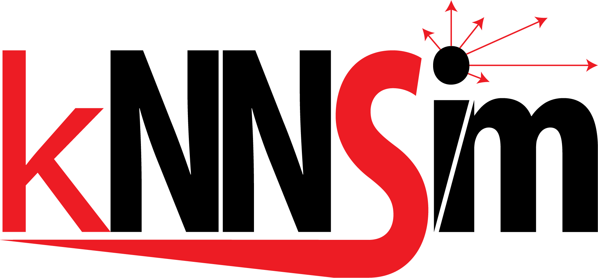

This repository contains a simulator written in C language to evaluate the performance of the K-Nearest Neighbors clustering algorithm in different platforms, the kNNSim.

1. [Content of this repository](#content-of-this-repository)
2. [Usage](#usage)
3. [How to compile datasets](#how-to-compile-datasets)

## Content of this repository

The content of this repository is as follows:
* `./` contains the source of the simulator. To compile:
  - **Linux:** type `make`;
  - **macOS:** define `MACOS=1` as a bash variable and type `make`.
* `./datasets/` contains the raw data of seven datasets that were download from [UCI Machine Learning Repository](https://archive.ics.uci.edu/ml/index.php) and precompiled binaries that can be used out of the box with kNNSim:
  * [Iris](https://archive.ics.uci.edu/ml/datasets/Iris)
  * [Wine](https://archive.ics.uci.edu/ml/datasets/Wine)
  * [Breast Cancer Wisconsin (Diagnostic)](https://archive.ics.uci.edu/ml/datasets/Breast+Cancer+Wisconsin+%28Diagnostic%29)
  * [Car Evaluation](https://archive.ics.uci.edu/ml/datasets/Car+Evaluation)
  * [Abalone](https://archive.ics.uci.edu/ml/datasets/Abalone)
  * [Human Activity Recognition Using Smartphones](https://archive.ics.uci.edu/ml/datasets/Human+Activity+Recognition+Using+Smartphones)
  * [Bank Marketing](https://archive.ics.uci.edu/ml/datasets/Bank+Marketing)
  * [Poker Hand](https://archive.ics.uci.edu/ml/datasets/Poker+Hand)
  * [Ionosphere](https://archive.ics.uci.edu/ml/datasets/ionosphere)
  * Additionally, there is source code on `./datasets/8_dataset_gen` to generate random datasets. This tool is, however, unnecessary since kNNSim generates random datasets natively whenever a binary file is not provided.
* `./results/` contains some experimental results extracted from several runnings on different systems.

## Usage

To know how to use kNNSim, just type `./knnsim -h` after compiling the software. It will produce:
```
[USAGE]: ./knnsim <#training> <#testing> <#features> <#classes> <#neighbors> [options]
|_ #training: size of the training subset
|_ #testing: size of the testing subset
|_ #features: number of features per each sample
|_ #classes: number of different classes in the training subset (smaller than #training)
|_ #neighbors: (k) number of closest neighbors needed to testing a sample
|_ options:
   |_ --run-type, -r: run-type plain or multithread (default=plain)
   |_ --number-of-threads, -t: number of threads (default=)
   |_ --input-file, -f: binary file that includes training samples, testing samples and classes (default=)
   |_ --solution-file, -s: file with the actual classes of the classified samples that allows calculating kNN accuracy (default=)
   |_ --distance-metric, -d: distance metric ssd, euclidean, cosine, chi-square, minkowsky or manhattan (default=ssd)
   |_ --minkowsky-p, -p: parameter p of minkowsky distance (default=2)
```

When not specifying a binary input file, the used dataset will be randomly generated by kNNSim. Since the K-Nearest Neighbors algorithm is deterministic, the performance of KNN is not affected by the quantitative values of the coordinates from the dataset.

When using a real precompiled dataset, the necessary parameters to run it can be found at `./datasets/<dataset_name>/<dataset_name>.cfg`. For instance, to use the dataset on `./datasets/bin/7_poker_hand.bin`, the parameters can be found in `./datasets/7_poker_hand/poker.cfg`. For example:
```
./knnsim 25010 1000000 10 10 4 --run-type multithread --input-file datasets/bin/7_poker_hand.bin
```

The output can be, for instance:
```
[CLASSIFIER SUMMARY]:
|_ hostname: odyssey.joaomiguelvieira.com
|_ run-type: multithread
   |_ #threads: 4
|_ metric: ssd
|_ k: 4
[DATASET SUMMARY]:
|_ training: 25010
|_ testing: 1000000
|_ features: 10
|_ classes: 10
|_ input file: datasets/bin/7_poker_hand.bin
[PERFORMANCE RESULTS]:
|_ execution time:
   |_ total [s]: 149.991904
```

## How to compile datasets

Datasets have to have a fixed format to be used by kNNSim. The file containing the training samples, the test samples and the classes of the training samples has to be binary and is organized as follows:
1. `N * M` floats corresponding to the training samples. Let A be the universe of training samples with `A(i) = a(i, 0), a(i, 1), ..., a(i, M-1)` a training sample and respective coordinates, then it should be organized in the binary dataset file in the format:
```
  a(0, 0),   a(0, 1), ...,   a(0, M-1)
  a(1, 0),   a(1, 1), ...,   a(1, M-1)
     :          :               :
a(N-1, 0), a(N-1, 1), ..., a(N-1, M-1)
```
2. `N' * M` floats corresponding to the test samples. Let B be the universe of test samples with `B(i) = b(i, 0), b(i, 1), ..., b(i, M-1)` a training sample and respective coordinates, then it should be organized in the binary dataset file in the format:
```
   b(0, 0),    b(0, 1), ...,    b(0, M-1)
   b(1, 0),    b(1, 1), ...,    b(1, M-1)
      :           :                :
b(N'-1, 0), b(N'-1, 1), ..., b(N'-1, M-1)
```
3. `N` integers corresponding to the classes of the training samples. Let `C(A(i))` be the class of the training sample `i`, then the classes should be organized in the binary dataset file as follows:
```
C(A(0)), C(A(1)), ..., C(A(N-1))
```
